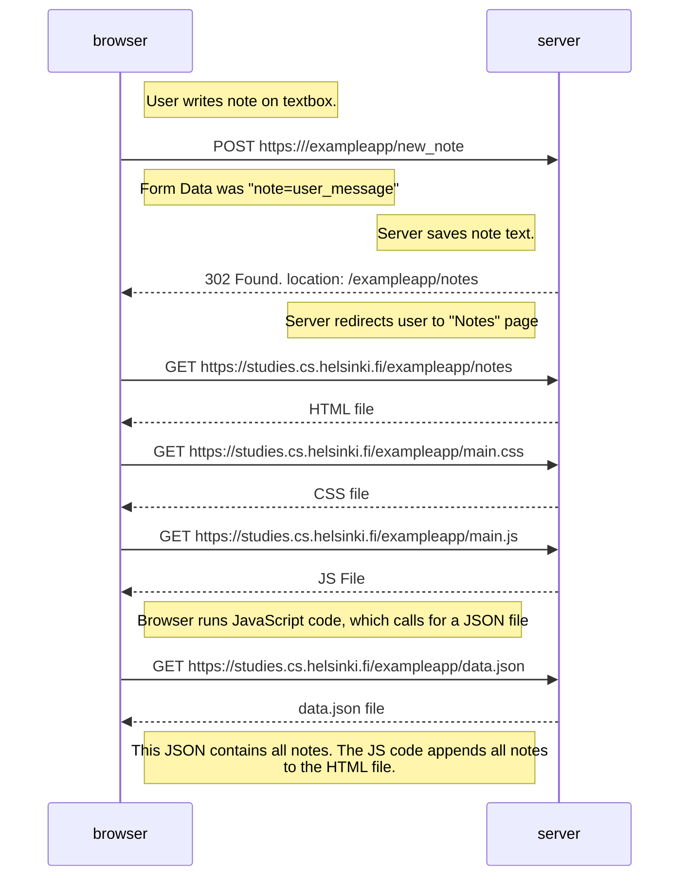

```mermaid
    sequenceDiagram
        participant browser
        participant server

        Note right of browser: User writes note on textbox.
        browser->>server: POST https:///exampleapp/new_note
        Note right of browser: Form Data was "note=user_message"
        Note left of server: Server saves note text.
        server-->>browser: 302 Found. location: /exampleapp/notes
        Note left of server: Server redirects user to "Notes" page
        browser->>server: GET https://studies.cs.helsinki.fi/exampleapp/notes
        server-->>browser: HTML file
        browser->>server: GET https://studies.cs.helsinki.fi/exampleapp/main.css
        server-->>browser: CSS file
        browser->>server: GET https://studies.cs.helsinki.fi/exampleapp/main.js
        server-->>browser: JS File
        Note right of browser: Browser runs JavaScript code, which calls for a JSON file
        browser->>server: GET https://studies.cs.helsinki.fi/exampleapp/data.json
        server-->>browser: data.json file
        Note right of browser: This JSON contains all notes. The JS code appends all notes <br/> to the HTML file.
```