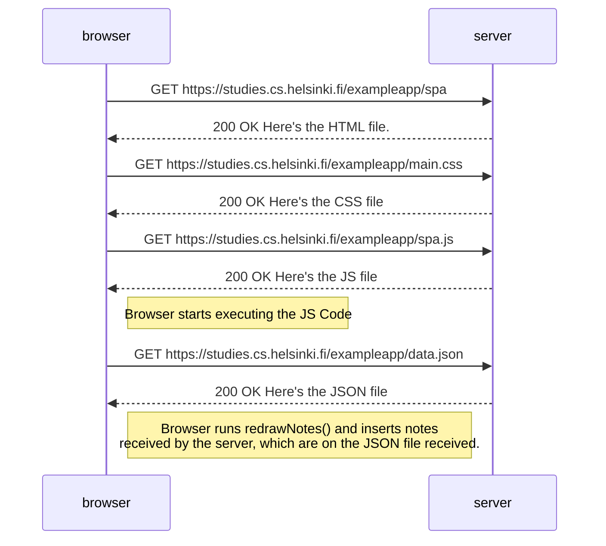

```mermaid
    sequenceDiagram
        participant browser
        participant server

        browser->>server: GET https://studies.cs.helsinki.fi/exampleapp/spa
        server-->>browser: 200 OK Here's the HTML file.
        browser->>server: GET https://studies.cs.helsinki.fi/exampleapp/main.css
        server-->>browser: 200 OK Here's the CSS file
        browser->>server: GET https://studies.cs.helsinki.fi/exampleapp/spa.js
        server-->>browser: 200 OK Here's the JS file
        Note right of browser: Browser starts executing the JS Code
        browser->>server: GET https://studies.cs.helsinki.fi/exampleapp/data.json
        server-->>browser: 200 OK Here's the JSON file
        Note right of browser: Browser runs redrawNotes() and inserts notes  <br />received by the server, which are on the JSON file received.
```