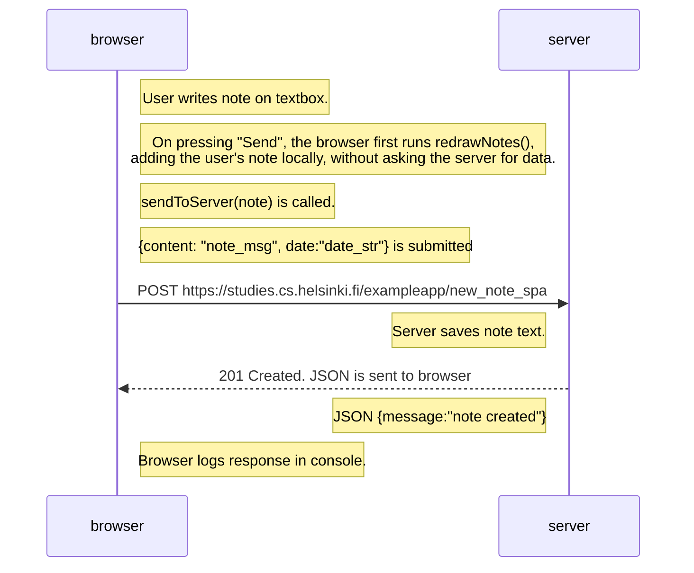

```mermaid
    sequenceDiagram
        participant browser
        participant server

        Note right of browser: User writes note on textbox.
        Note right of browser: On pressing "Send", the browser first runs redrawNotes(), <br /> adding the user's note locally, without asking the server for data.
        Note right of browser: sendToServer(note) is called.
        Note right of browser: {content: "note_msg", date:"date_str"} is submitted
        browser->>server: POST https://studies.cs.helsinki.fi/exampleapp/new_note_spa
        Note left of server: Server saves note text.
        server-->>browser: 201 Created. JSON is sent to browser
        Note left of server: JSON {message:"note created"}
        Note right of browser: Browser logs response in console.
```